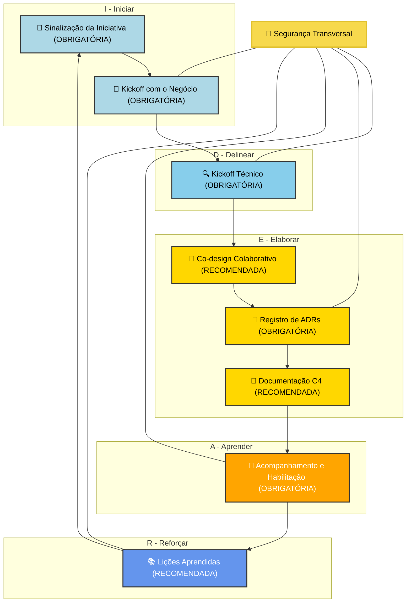
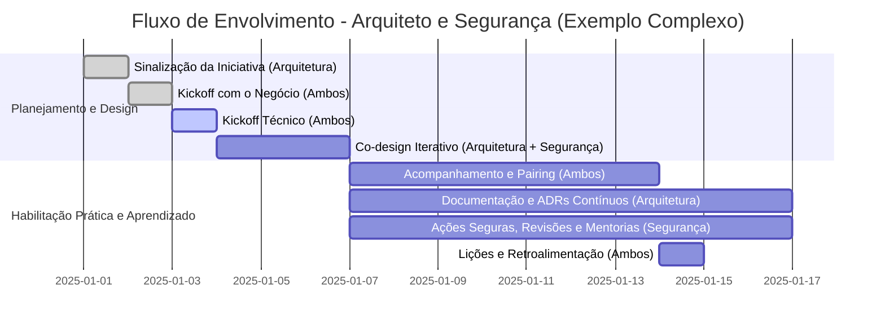
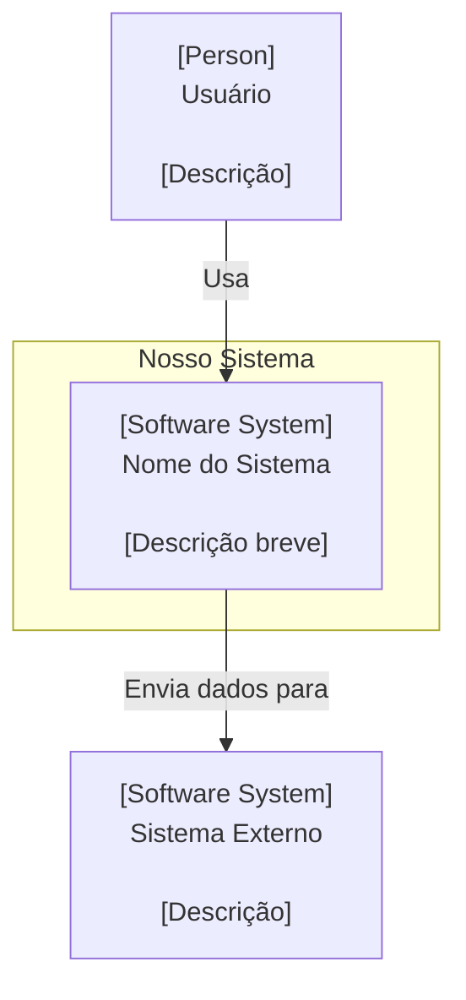
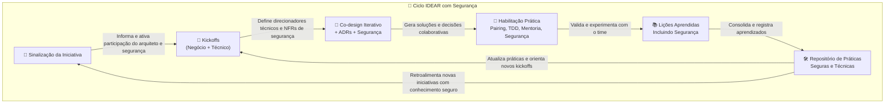

# Processo de Trabalho para Arquitetos de Soluções em Times Habilitadores (Team Topologies)

Histórico de Versões do Processo IDEAR
--------------------------------------

| Versão | Data       | Autor/Responsável | Alterações Principais                             |
| ------ | ---------- | ----------------- | ------------------------------------------------- |
| 1.0    | 10/07/2025 | Márcio Rosner     | Documento inicial com estrutura IDEAR consolidada |
|        |            |                   |                                                   |

ℹ️ Este histórico serve para manter a rastreabilidade e evolução contínua do processo. IDEAR é um modelo vivo que deve evoluir com os aprendizados organizacionais e tecnológicos.

---

## 🔐 Segurança Transversal no Processo IDEAR

> 🔐 **Nota do Autor:** Segurança é um aspecto **transversal**, que permeia todas as fases do IDEAR.  
> Ela não deve ser tratada como uma etapa isolada ou silo funcional, mas como um compromisso compartilhado e contínuo.  
> Recomendamos sempre perguntar:  
> “Quais decisões de segurança estão sendo feitas nesta fase? Elas foram documentadas e testadas?”


O logo foi cuidadosamente desenhado para refletir os princípios fundamentais do IDEAR:

* **O Ciclo Contínuo:** A forma circular e segmentada do logo simboliza o fluxo ininterrupto e a interconexão das fases Iniciar, Delinear, Elaborar, Aprender e Reforçar. Ele ecoa a ideia de um ciclo de valor e colaboração constante.

* **Segurança Integrada:** O cadeado posicionado centralmente não é um mero adorno, mas um lembrete visual poderoso da importância da segurança como um aspecto transversal e intrínseco a cada etapa do processo IDEAR. Segurança por design, não como um pós-pensamento.

* **Cores e Significado:** O **azul** transmite confiabilidade, profissionalismo e profundidade técnica. O **laranja** adiciona um toque de inovação, energia e o dinamismo necessário para a transformação e a colaboração efetiva.

Este logo é a a representação visual de um processo de arquitetura de software moderno, seguro e continuamente evolutivo.

---

# Índice

1. Introdução
2. Objetivos
3. Visão Geral do Time Habilitador em Arquitetura
4. Justificativa para o Processo
5. Apresentando o IDEAR: Uma Visão Guiada
6. Estrutura IDEAR: Fases e Atividades **(NO JIRA)**
7. Momentos de Atuação do Arquiteto de Soluções
8. Entregáveis Esperados dos Arquitetos
9. Templates Markdown para Documentação
10. Rastreabilidade entre Jira e Git
11. Repositório de Boas Práticas Arquiteturais e Aprendizados
12. Checklist de Validação Técnica e Negocial
13. Visão Geral do Ciclo de Feedback
14. Benefícios da Abordagem
15. Considerações Finais
16. Referências Utilizadas
17. Explicação de Siglas e Abreviações

---

# 1. Introdução

Este documento apresenta um processo estruturado para a atuação de arquitetos de soluções e segurança inseridos em times habilitadores, segundo os princípios do Team Topologies. O objetivo principal é estabelecer um modelo claro, didático e aplicável que permita aos times de desenvolvimento serem mais autônomos, conscientes tecnicamente e alinhados ao negócio, assegurando qualidade, rastreabilidade e evolução contínua das decisões arquiteturais, através da participação proativa e estruturada da arquitetura e segurança.

---

# 2. Objetivos

Incorporar os princípios de que a arquitetura é uma prática **adaptável, contínua e colaborativa**. O processo aqui descrito não é uma lei rígida, mas um guia flexível que visa capacitar os times através da colaboração prática, transformando documentos em ferramentas vivas e o feedback em um motor para a evolução constante.

São os principais objetivos:

* Estabelecer um processo organizado para atuação dos arquitetos de soluções e profissionais de segurança;

* Otimizar a colaboração entre arquitetura, segurança e times de desenvolvimento;

* Reduzir riscos técnicos e aumentar a rastreabilidade de decisões;

* Promover a habilitação e a autonomia técnica dos times;

* Alinhar a atuação do arquiteto e profissional de segurança aos ciclos de descoberta e entrega de valor.

# 3. Visão Geral do Time Habilitador em Arquitetura e Segurança

Um time habilitador de arquitetura e segurança não é responsável direto por entregas de produto, mas sim por transferir conhecimento técnico e boas práticas aos times de produto e desenvolvimento, habilitando os demais times a executar as tarefas arquiteturais e de segurança de forma consiente e confiante.

O arquiteto de soluções juntamente com o profissional de segurança nesse modelo atuam como mentores técnicos, facilitadores de decisões e impulsionador da sustentabilidade arquitetural e de segurança.

É crucial observar as responsabilidades do profissional habilitador para que ele não seja visto como um gargalo, mas como um acelerador:

- **Mentor Prático:** Foca em capacitar o time através de atividades "mão na massa", como sessões de pairing em programação, refatoração e correções de segurança. 
- **Facilitador de Decisões:** Ajuda o time a navegar por escolhas técnicas complexas, documentando-as de forma colaborativa. 
- **Impulsionador da Sustentabilidade:** Garante que as boas práticas de arquitetura, design, código e segurança sejam disseminadas e, mais importante, praticadas.

### São metas do profissional habilitador:

- Ajudar o time a tomar melhores decisões técnicas.
- Promover boas práticas de documentação, design e segurança.
- Reduzir dependências técnicas e aumentar a autonomia dos times.

### Características de um profissional habilitador:

* Atua de forma proativa, colaborativa e contínua;

* Foca na transferência de conhecimento técnico;

* Monitora a evolução da maturidade dos times;

* Prioriza o impacto organizacional à centralização de decisões.

---

# 4. Justificativa para o Processo

Inspirado pelos princípios de Domain-Driven Design (Eric Evans), Clean Architecture (Robert Martin) e Team Topologies (Skelton & Pais), este processo busca resolver problemas recorrentes como:

- Falta de visibilidade e rastreabilidade sobre decisões técnicas;
- Decisões arquiteturais e de segurança tardias e mal embasadas, gerando retrabalho.
- Falta de documentação viva, acessível e rastreável;
- Baixa autonomia técnica dos times de desenvolvimento.
- Alinhamento fraco entre técnica e estratégia de negócio.

### Considerações:

- O entendimento do domínio é essencial e deve ser trabalhado junto ao habilitador de arquitetura e segurança desde o início.
- Os aprendizados de segurança devem retroalimentar a modelagem de domínio, exemplo: 
  - Conceitos como “token expirado” ou “auditoria de transações” fazem parte do vocabulário de negócio
- A arquitetura deve emergir dos casos de uso, e isso exige participação contínua.
- Habilitação eficaz requer ações práticas de mentoria, pairing e evolução da autonomia técnica.

## Os princípios fundamentais que guiam a aplicação deste processo são:

1. **Adaptabilidade:** O processo é um **template flexível**. Sua aplicação (quais etapas e com qual intensidade) deve ser proporcional à complexidade e ao risco da iniciativa. Para uma tarefa simples, uma conversa e um ADR podem ser suficientes. Para um novo microsserviço, o fluxo completo pode ser necessário. 

2. **Arquitetura Contínua:** Evita-se a armadilha do "mini-waterfall". A arquitetura não é uma fase inicial, mas uma prática que permeia todo o ciclo de vida do desenvolvimento. 

3. **Domínio é Soberano e Contínuo:** O entendimento do negócio é a força motriz das decisões técnicas e deve ser refinado constantemente, não apenas em uma reunião de kickoff. 

4. **Habilitação Focada em Código:** A verdadeira capacitação acontece na prática. O sucesso é medido pela melhoria da qualidade do código, pela autonomia do time e pela redução da complexidade, não pela quantidade de documentos produzidos.

## Lembrete:

- Este processo é inspirado por uma síntese de ideias de Eric Evans (DDD), Robert C. Martin (Clean Architecture) e os autores de Team Topologies (Skelton/Pais). Ele foi criado para ser um "andaime" (scaffold) que oferece suporte, não uma "gaiola" que limita.

---

## 5.Apresentando o IDEAR: Uma Visão Guiada



O processo IDEAR não é apenas um acrônimo; é uma filosofia de trabalho que organiza as melhores práticas da engenharia de software moderna em um fluxo de valor contínuo. Cada fase foi desenhada com base nos princípios de **Domain-Driven Design (DDD)**, **Clean Architecture** e **Team Topologies**, para garantir que não estamos apenas construindo o software _corretamente_, mas também construindo o _software certo_ e, ao mesmo tempo, _fortalecendo nossos times_.

Além de sua base filosófica, o ciclo IDEAR pode ser potencializado por uma camada estratégica: os **OKRs (Objectives and Key Results)**. Eles atuam como uma "estrela-guia", garantindo que cada fase — desde a concepção até o aprendizado — esteja alinhada não apenas com as boas práticas, mas com o que é mais importante para a organização. Na prática, os OKRs definidos na fase **Iniciar** são revisitados na fase **Reforçar**. Isso cria um poderoso ciclo de feedback que nos permite perguntar não apenas "concluímos o trabalho?", mas sim "**o trabalho que concluímos gerou o impacto que esperávamos?**". Dessa forma, o IDEAR transcende de um processo de excelência tática para se tornar um motor de impacto estratégico, conectando o código do dia a dia aos resultados que realmente importam.

#### **I - Iniciar:** O Ponto de Partida no Domínio

Nesta fase, o objetivo é responder à pergunta mais importante de todas: **"Qual problema de negócio estamos resolvendo?"**. As atividades de "Sinalização da Iniciativa" e "Kickoff com o Negócio" garantem que o time habilitador seja envolvido desde o primeiro momento para compreender o domínio, os objetivos e as restrições.

> **Justificativa:** "Iniciar aqui é a essência do **Domain-Driven Design**. Todo esforço de software que não começa com uma imersão profunda no domínio do negócio corre o risco de ser uma solução elegante para o problema errado. Esta fase é onde forjamos a **Linguagem Ubíqua** com os especialistas, garantindo que desenvolvedores, arquitetos e o negócio falem o mesmo idioma. O `contexto_negocio.md` não é burocracia; é o primeiro artefato do nosso modelo de domínio compartilhado."

#### **D - Delinear:** Definindo as Fronteiras Técnicas

Com o problema de negócio compreendido, a fase de Delinear traduz o "porquê" em "o quê". Através do "Kickoff Técnico", definimos as fronteiras da solução, os Requisitos Não Funcionais (NFRs) e os riscos técnicos. É o momento de estabelecer as regras do jogo que guiarão nossas decisões.

> **Justificativa:** "Uma boa arquitetura começa com a definição das políticas de alto nível, não com a escolha de frameworks ou bancos de dados. Esta fase ecoa a **Clean Architecture**: nós delineamos os **casos de uso** e as restrições (NFRs) que formam o núcleo da nossa aplicação. Essas regras são o coração do sistema e devem ser independentes dos detalhes de implementação. Delinear é o ato de construir a fundação e as paredes da casa antes de decidir a cor da tinta."

#### **E - Elaborar:** Tomando Decisões Conscientes e Colaborativas

Esta é a fase do "como". Através do co-design, da criação de diagramas C4 e do registro de Decisões Arquiteturais (ADRs), o time colabora para desenhar uma solução. O foco não é produzir uma documentação exaustiva, mas sim registrar as decisões mais importantes e seus **trade-offs** de forma clara e honesta.

> **Justificativa:** "Elaborar é onde a disciplina profissional encontra a modelagem criativa. O registro de ADRs é um ato de responsabilidade; é a garantia de que as futuras gerações de desenvolvedores entenderão o _porquê_ por trás das nossas escolhas. Para **Eric Evans**, o co-design é a exploração do _espaço da solução_, onde refinamos nosso modelo em um design que pode ser implementado. Juntos, garantimos que a solução seja tecnicamente sólida e fiel ao domínio de negócio."

#### **A - Aprender:** Capacitando Através da Prática

A arquitetura não termina quando o design está pronto. A fase de Aprender é contínua e focada em garantir que a visão arquitetural seja implementada com qualidade. Isso acontece através do acompanhamento técnico, sessões de pairing, revisões de código e mentoria, com o objetivo final de aumentar a autonomia do time de desenvolvimento.

> **Justificativa:** "Esta fase é a personificação de um **Time Habilitador** de 'Team Topologies'. Nosso trabalho não é ser um gargalo de aprovação, mas sim remover os obstáculos para que os 'Times Alinhados a um Fluxo' possam entregar valor de forma rápida e segura. Através do pairing e da mentoria ('Aprender'), nós diminuímos a **carga cognitiva** do time, transferimos conhecimento e aumentamos sua capacidade. O sucesso de um time habilitador é medido pela sua própria irrelevância futura."

#### **R - Reforçar:** Transformando Aprendizado em Evolução

A fase final fecha o ciclo. As "Lições Aprendidas" de uma iniciativa não podem morrer com ela. Elas devem ser usadas para **reforçar** as práticas de toda a organização, atualizando templates, criando novos padrões no repositório de boas práticas e melhorando o próprio processo IDEAR.

> **Justificativa:** "Reforçar é o motor da melhoria contínua. É como evoluímos a nossa 'plataforma' interna, é como garantimos que o conhecimento sobre a arquitetura e o domínio se torne um ativo organizacional duradouro. Esta fase garante que não apenas entregamos um software, mas que nos tornamos uma **organização que aprende**, tornando cada novo ciclo mais rápido, seguro e eficiente que o anterior."

---

# 6. Estrutura IDEAR (Iniciar, Delinear, Elaborar, Aprender e Reforçar) - Fases e Atividades

## As etapas abaixo representam um fluxo completo e adaptável.

A estrutura **IDEAR** organiza o processo de atuação do arquiteto e profissionais de segurança em cinco fases contínuas e didáticas:


| Fase | Nome     | Atividades Internas                                                                                     | Foco Estratégico                                            | Participação de Segurança                                                                                          |
| ---- | -------- | ------------------------------------------------------------------------------------------------------- | ----------------------------------------------------------- | ------------------------------------------------------------------------------------------------------------------ |
| I    | Iniciar  | • Sinalização da Iniciativa no Jira• Kickoff com o Negócio (contexto_negocio.md)                        | Entendimento do domínio e riscos de negócio                 | Identificação de riscos iniciais, privacidade (ex: LGPD), contexto sensível, primeira análise de ameaças           |
| D    | Delinear | • Kickoff Técnico _(kickoff.md)_• Identificação de NFRs, restrições, integrações                        | Planejamento técnico e arquitetura base                     | Definição de requisitos não funcionais de segurança, threat modeling, recomendações de arquitetura segura          |
| E    | Elaborar | • Co-design colaborativo• Registro de ADRs• Diagramas C4 (c4_context.md, c4_containers.md) e trade-offs | Design técnico colaborativo, decisões arquiteturais         | Validação de padrões seguros, contribuições em ADRs, implicações de segurança explícitas nos modelos arquiteturais |
| A    | Aprender | • Acompanhamento técnico• Sessões de pairing e mentoria• Plano de habilitação _(habilitacao.md)_        | Capacitação prática e evolução da autonomia técnica do time | Mentorias em segurança, revisão de PRs com foco em práticas seguras, disseminação de boas práticas (ex: OWASP)     |
| R    | Reforçar | • Lições Aprendidas (licoes_aprendidas.md) • Atualização de padrões no repositório de boas práticas     | Retroalimentação organizacional, melhoria contínua          | Registro de vulnerabilidades evitadas, incidentes mitigados, contribuições para padrões seguros da organização     |


## Detalhamento:

### Iniciar – Sinalização da Iniciativa

- **Ação no Jira:** Criar épico com label `arquitetura-habilitacao`.
- **Objetivo:** Sinalizar a necessidade de apoio do time de arquitetura o mais cedo possível, permitindo uma atuação proativa.

### Iniciar – Kickoff com o Negócio

- **Atividade:** Workshop colaborativo para entender o problema, o domínio de negócio, as restrições e as oportunidades. 
- **Entregável Vivo:** `contexto_negocio.md`, a ser refinado conforme o aprendizado evolui.

### Delinear – Kickoff Técnico

- **Atividade:** Sessão para identificar Requisitos Não Funcionais (NFRs), limites de integração e o contexto técnico inicial. 
- **Entregável Vivo:** `kickoff.md` com a visão inicial dos casos de uso.

### Elaborar – Co-design da Solução

- **Atividade:** Sessões iterativas de design com o time, usando ferramentas como Event Storming, C4 Model e prototipagem (participação de UX). Esta etapa inclui o **refinamento contínuo do modelo de domínio**. 
- **Ação no Jira:** Tarefa “Sessão Técnica de Co-design Colaborativa”.

### Elaborar – Registro de Decisões (ADRs)

- **Atividade:** As decisões arquiteturais importantes são escritas *com* o time em ADRs, transformando o registro em um momento de aprendizado. 
- **Entregável Vivo:** Arquivos `adrs/adr-xxx.md`, que são documentos vivos e podem ser atualizados. 

### Elaborar – Documentação Arquitetural

- **Atividade:** Criação colaborativa de diagramas (C4 Nível 1 e 2) e documentação de trade-offs e integrações. 
- **Objetivo:** Não é gerar documentação exaustiva, mas sim a quantidade mínima necessária para um entendimento compartilhado.

#### Sobre Trade-offs:

- Em arquitetura de software, não existe "a melhor solução", apenas a solução mais apropriada para um **contexto de negócio específico**. Um trade-off é a escolha consciente de qual objetivo de negócio iremos priorizar. Pergunte-se sempre: "O que é mais valioso para o sucesso do nosso produto _agora_? Velocidade de entrega? Baixo custo? Escalabilidade futura?". A resposta a essa pergunta, vinda do domínio, é o que deve guiar a decisão técnica. Um trade-off sem contexto de negócio é apenas uma aposta no escuro.

- Ser profissional é assumir a responsabilidade por ela. A **disciplina da engenharia** exige que todo trade-off seja uma decisão deliberada e, acima de tudo, **documentada**. Não basta escolher, é preciso registrar com clareza: "Nós conscientemente abrimos mão de _X_ (ex: consistência imediata) para obter _Y_ (ex: alta disponibilidade), e entendemos as consequências _Z_ (ex: a necessidade de mecanismos de compensação)". Essa documentação é uma mensagem para os futuros mantenedores do código, garantindo a integridade e a rastreabilidade das nossas decisões.

- Portanto, um trade-off bem documentado não é um sinal de fraqueza na arquitetura. Pelo contrário, é a marca de uma **equipe madura** que alinha tecnologia com estratégia. É o ponto onde a engenharia de software se torna uma ferramenta de comunicação honesta sobre as prioridades e os sacrifícios que estamos dispostos a fazer para atingir nossos objetivos.

### Aprender – Acompanhamento e Habilitação Contínua

**Atividade:** Esta é a fase mais prática, focada em: 

- **Sessões de pairing focadas em TDD, refatoração de código e revisões técnicas**. 
- **Revisões técnicas construtivas** (PR reviews). 
- **Refinamento da Linguagem Ubíqua** com base nas descobertas da implementação. 
- **Entregável:** O resultado principal é o **aumento da capacidade do time**, com o `acompanhamento.md` servindo apenas como um registro das ações.

### Reforçar – Lições Aprendidas e Retroalimentação

- **Atividade:** Sessão de retrospectiva técnica focada no "como" trabalhamos. 

- **Objetivo:** O resultado desta sessão deve ser um conjunto de **ações concretas**: 
  
  - Atualizar um template no repositório de boas práticas. 
  - Agendar um workshop sobre um tema de dificuldade recorrente. 
  - Refinar o `contexto_negocio.md` de um domínio. 
  - Propor um novo ADR com um padrão emergente.

- **Entregável:** `licoes_aprendidas.md`

> 📌 O IDEAR não é apenas uma sequência de etapas. É uma **estrutura cíclica e iterativa** que guia o arquiteto e profissional de segurança a transformar iniciativas em conhecimento compartilhado, valor técnico e aprendizado organizacional.

### 🧾 Resumo do Diagrama das Etapas

| Etapa                                     | Obrigatória?   | Quando aplicar?                                | Por que é importante?                                                      |
| ----------------------------------------- | -------------- | ---------------------------------------------- | -------------------------------------------------------------------------- |
| Iniciar: Sinalização                      | ✅ Sim          | Sempre que surgir nova iniciativa              | Garante que o arquiteto atue desde o início.                               |
| Iniciar: Kickoff com o Negócio            | ✅ Sim          | Antes de qualquer modelagem técnica            | Ajuda a entender o **problema do negócio** e **restrições reais**.         |
| Delinear: Kickoff Técnico                 | ✅ Sim          | Antes do desenvolvimento começar               | Levanta requisitos técnicos (NFRs) e riscos.                               |
| Elaborar: Co-design da Solução            | 🟡 Recomendado | Projetos mais complexos ou novos sistemas      | Permite soluções melhores com envolvimento de todos.                       |
| Elaborar: Registro de ADRs                | ✅ Sim          | Sempre que há decisão técnica importante       | Garante rastreabilidade e entendimento futuro das escolhas técnicas.       |
| Elaborar: Documentação Arquitetural       | 🟡 Recomendado | Quando há integrações ou múltiplos componentes | Ajuda o time a visualizar a solução de forma clara.                        |
| Aprendizado: Acompanhamento e Habilitação | ✅ Sim          | Durante o desenvolvimento                      | Ensina o time a tomar decisões técnicas com confiança.                     |
| Reforçar: Lições Aprendidas               | 🟡 Recomendado | Após entregas ou encerramento                  | Permite que todos aprendam com os acertos e erros e melhorem os processos. |

--------------------------------------------------------------


---

# 7. Momentos de Atuação do Arquiteto de Soluções

Visualizar a jornada ajuda a entender a distribuição do esforço ao longo do tempo tanto para arquitetos de soluções quanto para profissionais de segurança.

O diagrama abaixo ilustra um **fluxo colaborativo possível para uma iniciativa complexa**, destacando as participações típicas de cada perfil do time habilitador.

⚠️ Não deve ser interpretado como uma linha do tempo rígida ou “em cascata”:

* A intensidade e a duração de cada fase são adaptáveis;

* O foco do arquiteto e do profissional de segurança se move do planejamento e design para a habilitação prática e o aprendizado conjunto.



### 📌 Participações Críticas e Obrigatórias por Fase:

| Fase         | Arquiteto de Soluções                                                                                           | Profissional de Segurança 🔐                                           |
| ------------ | --------------------------------------------------------------------------------------------------------------- | ---------------------------------------------------------------------- |
| **Iniciar**  | Participa desde a sinalização e no kickoff com o negócio para compreender os objetivos e restrições.            | Avalia riscos iniciais e contexto sensível (ex: LGPD, compliance).     |
| **Delinear** | Lidera levantamento técnico, define requisitos com o time e identificação de riscos.                            | Contribui com requisitos de segurança (NFRs), threat modeling.         |
| **Elaborar** | Facilita co-design, registra ADRs, contribui com modelagens C4 e apoio na documentação técnica.                 | Valida implicações de segurança nas decisões e nas integrações.        |
| **Aprender** | Acompanha a execução, promove pairing, mentoria contínua e habilitação para o time alcançar autonomia.          | Monitora práticas seguras, revisa PRs, oferece mentorias de segurança. |
| **Reforçar** | Registra aprendizado, atualiza padrões organizacionais, revisão de boas práticas e disseminação organizacional. | Reforça padrões seguros, registra incidentes e vulnerabilidades.       |

> 🔄 Essa abordagem integrada reforça que **arquitetura e segurança devem atuar em colaboração contínua**, como propõe o modelo de time habilitador ideal descrito por Skelton e Pais.


---

# 8. Entregáveis Esperados

A ênfase muda do "documento como um fim" para o "documento como um meio" de comunicação e alinhamento contínuo, ou seja, os artefatos gerados são ferramentas para o time, não burocracia para o processo. Seu valor está no uso e na sua capacidade de evoluir.

Um time habilitador atua como um conjunto de competências, não como funções individuais. A entrega é do time como unidade.

Assim a seguir estão listados os entregáveis esperados do time habilitador, que incluem tanto os arquitetos de soluções quanto os profissionais de segurança 🔐. Esses artefatos são versionados junto ao repositório da iniciativa e visam garantir rastreabilidade, alinhamento técnico e segurança desde a concepção: 

| Documento                           | Objetivo                                                                                                                                                                 | Natureza do Documento                           | Responsável Principal      |
| ----------------------------------- | ------------------------------------------------------------------------------------------------------------------------------------------------------------------------ | ----------------------------------------------- | -------------------------- |
| `contexto_negocio.md`               | Objetivos , visão de negócio, restrições e domínio do problema                                                                                                           | Vivo e Contínuo                                 | Arquitetura                |
| `kickoff.md`                        | Casos de uso, escopo técnico, visão técnica, NFRs, dependências e riscos                                                                                                 | Vivo e Contínuo                                 | Arquitetura + Segurança 🔐 |
| `habilitacao.md`                    | Plano para evolução da autonomia técnica do time                                                                                                                         | Registro de Ações (o valor está na execução)    | Arquitetura                |
| segurança.md                        | Ameaças, requisitos de segurança, ações mitigadoras e participação segura                                                                                                | Vivo e Contínuo                                 | Segurança 🔐               |
| `c4_context.md`/ `c4_containers.md` | Diagrama C4 de contexto e containers.                                                                                                                                    | Vivo e Contínuo                                 | Arquitetura                |
| `adrs/adr-xxx.md`                   | Decisões técnicas registradas com justificativa (inclui segurança 🔐.                                                                                                    | Vivo (pode ser marcado como 'superado')         | Arquitetura + Segurança 🔐 |
| `acompanhamento.md`                 | Registro de mentorias, pairing e evolução técnica                                                                                                                        | Registro de Ações (o valor está na capacitação) | Arquitetura + Segurança 🔐 |
| `licoes_aprendidas.md`              | Síntese de aprendizados técnicos, processuais e de segurança 🔐 que geram ações e recomendações pós-entrega: Síntese do que funcionou, o que melhorar, impactos futuros. | Motor de Melhoria                               | Arquitetura + Segurança 🔐 |

Esses artefatos são fundamentais para garantir:

* Visibilidade técnica e negocial

* Segurança por design

* Evolução arquitetural contínua

* Transferência de conhecimento e habilitação de times

---

# 9. Templates Markdown para Documentação

Templates padronizados reduzem a carga cognitiva e garantem que informações essenciais não sejam esquecidas e promovem uma comunicação consistente entre os times. Eles são a materialização das "estradas pavimentadas" que um Time Habilitador deve oferecer.

A seguir estão os templates mínimos para cada um dos entregáveis definidos no processo IDEAR. Eles foram desenhados para serem leves, versionáveis no Git e para servirem como ferramentas de comunicação viva, não como documentos estáticos.

O `habilitacao.md` foi criado para focar em ações práticas e critérios de sucesso mensuráveis, inclusive no nível do código.

```
docs/
├── contexto_negocio.md
├── kickoff.md
├── habilitacao.md
├── acompanhamento.md
├── seguranca.md 🔐
├── licoes_aprendidas.md
├── arquitetura/
│   ├── c4_context.md
│   └── c4_containers.md
├── adrs/
│   └── adr-001-nome-decisao.md
```

Cada template deve ser versionado junto ao código no repositório Git do time.

1. Template: `contexto_negocio.md`: Comece aqui. Sempre. Se você não consegue preencher isso, você não entendeu o problema.
   
   ```
   # Contexto de Negócio: [Time/Nome da Iniciativa]
   
   - **Data:** DD/MM/AAAA
   - **Autores:** [Nome do Arquiteto], [Nome do PO/Business Analyst]
   - **Jira Épico:** [Link para o Épico]
   - **Status:** [Rascunho | Em Revisão | Ativo]
   
   ## 1. Problema de Negócio
   *(Descreva em 1-3 parágrafos qual problema estamos tentando resolver. Qual é a dor do cliente ou a oportunidade de mercado?)*
   
   ## 2. Objetivos e Resultados Esperados (OKRs)
   *(O que define o sucesso desta iniciativa? Se possível, conecte aos OKRs estratégicos da empresa. Estes OKRs guiarão nossas decisões de trade-off.)*
   - **Objetivo 1:** ...
   - **Resultado Chave 1.1:** ...
   
   ## 3. Fora de Escopo
   *(O que explicitamente NÃO faremos nesta iniciativa para manter o foco?)*
   
   ## 4. Linguagem Ubíqua Inicial
   *(Liste os termos de negócio mais importantes que surgiram na conversa e suas definições.)*
   - **Termo 1:** Definição clara e sem ambiguidades.
   - **Termo 2:** Definição...
   ```

2. Template: `kickoff.md` - Agora traduza o 'porquê' do negócio no 'o quê' técnico. Seja explícito sobre as restrições e requisitos.
   
   ```
   # Kickoff Técnico: [Time/Nome da Iniciativa]
   
   - **Data:** AAAA-MM-DD
   - **Participantes:** [Arquiteto], [Segurança 🔐], [Tech Lead], [Devs]
   - **Jira Épico:** [Link para o Épico]
   
   ## 1. Casos de Uso Principais
   *(Liste os principais fluxos ou jornadas do usuário que o sistema deve suportar.)*
   1.  Como um [Usuário], eu quero [Fazer Ação], para [Obter Benefício].
   2.  ...
   
   ## 2. Requisitos Não Funcionais (NFRs)
   *(Quais são as restrições de qualidade que guiarão nossas decisões?)*
   - **Performance:** Ex: Tempo de resposta da API < 200ms.
   - **Disponibilidade:** Ex: Sistema deve ter 99.9% de uptime.
   - **Escalabilidade:** Ex: Suportar 10.000 usuários concorrentes.
   - **🔐 Segurança:** Ex: Todos os endpoints devem ser autenticados com OAuth2.
   
   ## 3. Contextos Delimitados (Bounded Contexts) Envolvidos
   *(Quais partes do nosso domínio de negócio são impactadas ou precisam interagir?)*
   - Contexto A (ex: Pagamentos)
   - Contexto B (ex: Entregas)
   
   ## 4. Riscos e Dependências Iniciais
   *(O que pode dar errado? De quais sistemas externos ou times dependemos?)*
   - **Risco 1:** A API do fornecedor X é instável.
   - **Dependência 1:** Precisamos que o Time Y libere o acesso ao banco de dados Z.
   ```

3. Template: `adrs/adr-xxx.md` -  Esta é a memória da nossa equipe. A decisão mais importante não é a escolha em si, mas o registro claro e honesto do porquê ela foi feita.
   
   ```
   # ADR-XXX: [Título da Decisão]
   
   - **Data:** AAAA-MM-DD
   - **Status:** [Proposto | Aceito | Depreciado | Superado por ADR-YYY]
   - **Autores:** [Nome], [Nome]
   - **Consultados:** [Arquiteto], [Segurança 🔐]
   
   ## Contexto
   *(Qual é o problema ou a força que nos leva a tomar uma decisão? Descreva o cenário.)*
   
   ## Decisão
   *(O que nós decidimos fazer? Seja claro e direto.)*
   Nós decidimos adotar [Solução/Padrão/Tecnologia X].
   
   ## Consequências (Trade-offs)
   *(Quais os resultados positivos e negativos desta decisão?)*
   - **Positivas:**
     - Benefício 1 (ex: Aumenta a disponibilidade do sistema).
     - Benefício 2 (ex: Reduz o acoplamento entre os serviços).
   - **Negativas:**
     - Sacrifício 1 (ex: Aumenta a complexidade do debug).
     - Sacrifício 2 (ex: Introduz consistência eventual, que precisa ser tratada).
   
   ## 🔐 Implicações de Segurança
   *(Como esta decisão impacta a segurança da aplicação?)*
   - Esta decisão [introduz/mitiga/não impacta] os seguintes riscos de segurança: ...
   - Ações de mitigação necessárias: ...
   ```

4. Template: `seguranca.md`
   
   ```
   # 🔐 Análise de Segurança: [Nome da Iniciativa]
   
   - **Data da última revisão:** AAAA-MM-DD
   - **Responsáveis:** [Profissional de Segurança], [Arquiteto]
   - **Jira Épico:** [Link para o Épico]
   
   ## 1. Ameaças Identificadas (Threat Modeling Simplificado)
   *(Com base nos casos de uso, quais são as principais ameaças?)*
   - **S**poofing (Falsificação): Um ator malicioso pode se passar por outro usuário?
   - **T**ampering (Adulteração): Os dados em trânsito ou em repouso podem ser alterados?
   - **R**epudiation (Repúdio): Um usuário pode negar que realizou uma ação?
   - **I**nformation Disclosure (Vazamento de Informação): Dados sensíveis podem ser expostos?
   - **D**enial of Service (Negação de Serviço): O serviço pode ser derrubado por um ataque?
   - **E**levation of Privilege (Elevação de Privilégio): Um usuário pode ganhar mais permissões do que deveria?
   
   ## 2. Requisitos e Controles de Segurança
   *(Com base nas ameaças, quais ações concretas e controles devemos implementar?)*
   - **Controle 1:** Implementar autenticação JWT em todos os endpoints.
   - **Controle 2:** Criptografar dados sensíveis no banco de dados com AES-256.
   - **Controle 3:** Validar e sanitizar todos os inputs do usuário para prevenir XSS/SQL Injection.
   
   ## 3. Plano de Habilitação em Segurança 🔐
   *(Quais ações o time habilitador fará para ajudar o time de desenvolvimento?)*
   - [ ] Sessão de Threat Modeling com o time.
   - [ ] Pairing para implementar o fluxo de autenticação.
   - [ ] Revisão de PRs com foco em vulnerabilidades comuns (OWASP Top 10).
   ```

5. Templates para `c4_context.md` e `c4_containers.md`
   
   ```
   # Diagrama de Contexto (C4 - Nível 1): [Nome do Sistema]
   
   - **Data da última revisão:** AAAA-MM-DD
   - **Autores:** [Nome do Arquiteto], [Time de Desenvolvimento]
   
   ## Descrição
   *(Explique em poucas palavras o que este sistema faz, para quem e por quê.)*
   
   ## Diagrama
   ```



6. Templates para `habilitacao.md`, `acompanhamento.md` e `licoes_aprendidas.md`

### Exemplo de `habilitacao.md`

```markdown
# Plano de Habilitação Técnica: [Nome do Time/Projeto]

## Nível Atual de Autonomia
- [x] Alta Dependência
- [ ] Habilitação Moderada
- [ ] Alta Autonomia

## Habilidades a Desenvolver
- Escrita de testes unitários eficazes (TDD).
- Documentação de ADRs de forma autônoma.
- Análise de NFRs de performance.

## Ações Planejadas e Foco Prático
| Ação | Frequência | Responsável | Foco Prático |
|---|---|---|---|
| Sessões de mentoria | Quinzenal | Arquiteto | Discutir trade-offs de um ADR |
| Pairing em PRs | Semanal | Arquiteto + Dev Lead | Refatoração para código limpo |
| **Pairing em TDD** | Sob demanda | Arquiteto + Dev | Implementar feature "Cálculo de Frete" |

## Critérios de Sucesso (Mensuráveis)
- [ ] Time escreve e aprova ADRs com autonomia em 2 sprints.
- [ ] Aumento de 15% na cobertura de testes da unidade `X`.
- [ ] Redução da complexidade ciclomática do método `Y` em 20%.
```

### Exemplo de Acompanhamento.md

```markdown
# Acompanhamento: acompanhamento.md
# Log de Acompanhamento: [Nome da Iniciativa]
```

| Data       | Participantes    | Tópico/Atividade | Pontos Relevantes e Decisões                                                     |
| ---------- | ---------------- | ---------------- | -------------------------------------------------------------------------------- |
| AAAA-MM-DD | Arquiteto, Dev A | Pairing em TDD   | Identificamos um bug na lógica de cálculo. Refatoramos usando o padrão Strategy. |
| AAAA-MM-DD | Segurança, Time  | Threat Modeling  | Mapeamos 3 ameaças críticas (ver `seguranca.md`).                                |

### Exemplo de `segurança.md`

```markdown
# 🔐 Análise de Segurança: [Time/Nome da Iniciativa]

- **Data da última revisão:** DD/MM/AAAA
- **Responsáveis:** [Profissional de Segurança], [Arquiteto]
- **Jira Épico:** [Link para o Épico]

## 1. Ameaças Identificadas (Threat Modeling Simplificado)
*(Use o modelo STRIDE como guia para identificar as principais ameaças.)*

- **Spoofing:** ...
- **Tampering:** ...
- **Repudiation:** ...
- **Information Disclosure:** ...
- **Denial of Service:** ...
- **Elevation of Privilege:** ...

## 2. Requisitos e Mitigações

### 2.1. Requisitos Não Funcionais de Segurança (NFRs)
*(Quais são as regras e propriedades de segurança que o sistema deve atender?)*

- **NFR 1:** Todas as APIs expostas devem exigir autenticação e autorização.
- **NFR 2:** Dados de usuários devem ser criptografados em repouso.
- **NFR 3:** O sistema deve manter logs de auditoria para ações financeiras.

### 2.2. Ações de Mitigação e Controles
*(Quais ações e controles técnicos implementaremos para atender aos NFRs e mitigar as ameaças?)*

- **Ação 1:** Implementar fluxo OAuth2 com JWT para atender ao NFR 1.
- **Ação 2:** Utilizar criptografia AES-256 no banco de dados para o NFR 2.
- **Ação 3:** Criar tabela de auditoria e registrar eventos de transação para o NFR 3.
- **Ação 4:** Adicionar validação de schema em todos os inputs da API para mitigar ameaças de Tampering.

## 3. Plano de Habilitação em Segurança 🔐
*(Quais ações o time habilitador fará para ajudar o time de desenvolvimento?)*

- [ ] Sessão de Threat Modeling detalhada com o time de desenvolvimento.
- [ ] Pairing para implementar o fluxo de autenticação e autorização.
- [ ] Revisão de PRs com foco em vulnerabilidades comuns (OWASP Top 10).
```


🔐 Esse template permite capturar, compartilhar e versionar todas as decisões, orientações e aprendizados relacionados à segurança.


### 🔁 Template Exemplo: `licoes_aprendidas.md`

```markdown
*Lições Aprendidas – [Time/Nome do Projeto]*

* **Data:** DD/MM/AAAA **Participantes:** [Time de Dev], [Arquiteto], [Segurança 🔐], [PO]

O que funcionou bem?

* *Ex: O kickoff técnico antecipado evitou retrabalho na integração X.*

O que podemos melhorar?

* *Ex: A modelagem inicial do domínio Y estava ambígua e gerou confusão.*

*Técnicas e Processuais*

* *A integração com sistema legado foi mais complexa do que o previsto.*
* *O time teve dificuldades com a modelagem do contexto de agregados.*

*Comunicação e Colaboração*

* *Kickoff técnico antecipado facilitou alinhamento com áreas externas.*
* *O co-design foi eficaz ao envolver devs e PO no início.*

*Lições de Segurança Identificadas 🔐*

* *Autenticação falhou em ambientes de homologação por falta de validação antecipada.*
* *Recomendação: inserir testes de segurança automatizados no pipeline CI/CD.*
* *Ex: A validação de tokens em ambiente de teste não estava robusta, o que causou falhas.*

*Impacto nas Práticas*

* Checklist de segurança criado para novas APIs REST. 🔐
* Templates de ADRs atualizados com seção obrigatória de segurança.

*Ações Concretas para o Futuro*

* [ ] **Ação:** Atualizar o template de projeto com um health check padrão. **Responsável:** [Nome].
* [ ] **Ação:** Agendar um workshop sobre modelagem de domínio. **Responsável:** [Arquiteto].
* [ ] **Ação:** Adicionar um teste de integração para validação de tokens no pipeline de CI. **Responsável:** [Segurança 🔐].


*(Opcional) Análise de Impacto nos OKRs*
*(Como o trabalho realizado nesta iniciativa contribuiu para os Resultados-Chave definidos no início?)*

- **Resultado-Chave impactado:** [Ex: Reduzir o tempo de ciclo em 15%]
  - **Evidência/Medição:** *Nesta entrega, automatizamos o pipeline de deploy, o que reduziu o tempo de publicação de 40 para 10 minutos.*
- **Resultado-Chave impactado:** [Ex: Diminuir vulnerabilidades em 50%]
  - **Evidência/Medição:** *A sessão de threat modeling (ver segurança.md) nos ajudou a evitar duas vulnerabilidades críticas de XSS que provavelmente chegariam à produção.*
```

- [ ] 🔐 _Dica_: Este template ajuda a transformar problemas recorrentes em conhecimento organizacional reaproveitável.

🔐 _Nota_: `seguranca.md` deve conter somente contexto técnico e ameaças. Todo aprendizado e lições sobre segurança devem ser consolidados em `licoes_aprendidas.md`.

---

# 10. Rastreabilidade entre Jira e Git

Conectar as ferramentas de gerenciamento e de código cria um fluxo de informação transparente, permitindo que qualquer pessoa navegue do "porquê" (Jira) para o "como" (Git) e vice-versa.

Esta prática simples, mas poderosa, garante que a documentação (que é "código" no Git) esteja sempre a um clique de distância da demanda que a originou, isso garante rastreabilidade completa de decisões e entregas técnicas.

No Jira (ex: na descrição de uma Task ou Épico):

```markdown
📎 **Documentos Vivos:**
- [Contexto de Negócio](https://git/repos/docs/contexto_negocio.md)
- [ADR-003: Escolha do Broker de Mensagens](https://git/repos/docs/adrs/adr-003.md)
- [kickoff.md](https://git/repos/docs/kickoff.md)
```

No Markdown (ex: no topo de um `kickoff.md`):

```markdown
🔗 **Demanda Relacionada:** [JIRA-123](https://jira/exemplo/JIRA-123)
```

---

# 11. Repositório de Boas Práticas Arquiteturais e Aprendizados

Centralizar o conhecimento evita que os times reinventem a roda e acelera a adoção de padrões de alta qualidade.

Este não é um repositório estático. Ele é um **produto do time habilitador**, ativamente mantido e enriquecido com os resultados das "Lições Aprendidas". 

Ele materializa a evolução da capacidade técnica da organização.

```
boas-praticas/
├── templates/             # Templates de README.md, projetos, etc.
├── modelos-adrs/          # Modelos de documentação para ADRs
├── exemplos-c4/           # Diagramas C4 de referência
├── checklists-nfrs/       # Checklists para NFRs comuns (performance, segurança)
├── lições-aprendidas/     # Documentação de Lições Aprendidas
└── padroes-decididos/     # ADRs globais com padrões validados
```

- Importante o compartilhamento de padrões reutilizáveis por todos os times.
- Esse conteúdo pode ser reaproveitado por múltiplos times e atualizado com base em experiências reais.

---

# 12. Checklist de Validação Técnica e Negocial

Um checklist ajuda a garantir que os aspectos cruciais da solução foram considerados antes de seguir para fases mais avançadas.

```markdown
- [ ] Os NFRs foram identificados e endereçados no design?
- [ ] As decisões críticas foram registradas em ADRs vivos e compartilhadas?
- [ ] Os limites de integração e dependências mapeadas estão claros e os contratos definidos?
- [ ] A documentação C4 mínima e necessária está clara para o time?
- [ ] O plano de habilitação tem ações práticas e mensuráveis?
- [ ] A autonomia do time foi avaliada e há um plano para melhorá-la?
- [ ] Aprendizados foram registrados ?
- [ ] O ciclo de feedback está funcionando (Lições Aprendidas gerando ações)?
```

---

# 13. Visão Geral do Ciclo de Feedback no IDEAR

O processo IDEAR deve ser visto como um ciclo virtuoso, não como uma linha reta, ou seja, um **ciclo de feedback contínuo**.

O final de uma iniciativa (Lições Aprendidas) é o começo da melhoria da próxima, alimentando todo o sistema com mais conhecimento e melhores ferramentas.



### 🧠 Explicações

* Toda iniciativa começa com uma sinalização clara no Jira, que leva aos kickoffs técnico e de negócio, onde também se levanta riscos de segurança desde o início.

* O kickoff estabelece a base para o co-design técnico e arquitetural — decisões aqui já incorporam requisitos não funcionais de segurança.

* As decisões tomadas são aplicadas e testadas com o time via habilitação prática e mentoria.

* A prática revela o que funciona, o que falha, e o que precisa ser ajustado — inclusive sobre segurança.

* As lições são registradas e usadas para atualizar os padrões organizacionais.

* O ciclo se fecha alimentando novas iniciativas com conhecimento validado.

### Considerações:

A arquitetura moderna não separa qualidade técnica de qualidade de segurança. Ambas evoluem com o feedback. O ciclo IDEAR precisa tornar esse aprendizado explícito, documentado e prático: 

* Os aprendizados de segurança devem retroalimentar a modelagem de domínio (ex: conceitos como “token expirado” ou “auditoria de transações” fazem parte do vocabulário de negócio).

* Todo ciclo deve produzir insumos para fortalecer e validar arquiteturais seguras, fazendo uso, sempre que possível, de testes automatizados.

* Recomenda-se manter **listas de verificação de segurança aprendida** no repositório de padrões (ex: top falhas de autenticação encontradas por time).

---

# 14. Benefícios da Abordagem

A aplicação da estrutura IDEAR traz uma série de benefícios práticos e estratégicos para o time de arquitetura e os times de desenvolvimento:

- **Clareza de papéis e responsabilidades**: A atuação do arquiteto é transparente e compreensível para todos os envolvidos.

- **Antecipação de riscos**: O arquiteto participa desde a sinalização da iniciativa, identificando riscos técnicos e oportunidades de melhoria.

- **Reforço da colaboração**: Momentos como o co-design e as sessões de acompanhamento incentivam decisões compartilhadas.

- **Registro contínuo de conhecimento**: ADRs, documentação em Markdown e lições aprendidas garantem rastreabilidade e evolução técnica.

- **Aumento da autonomia dos times**: Por meio da fase de Aprender, o arquiteto contribui diretamente com a capacitação da equipe.

- **Adaptação, flexibilidade, adoção fácil e escalável**: A estrutura IDEAR é simples, adaptável e pode ser aplicada tanto em projetos pequenos quanto em grandes iniciativas, conforme o contexto de cada projeto, evitando burocracia desnecessária.

- **Maior alinhamento** entre as soluções técnicas e a estratégia de negócio.

- **Redução de retrabalho**, pois as decisões são mais bem embasadas e tomadas mais cedo.
* **Um ciclo de aprendizagem contínuo** que melhora a qualidade do código e dos produtos.

* **Decisões claras e rastreáveis**, facilitando a manutenção e a evolução dos sistemas.

---

# 15. Considerações Finais

A atuação do arquiteto como habilitador, guiada pelo processo IDEAR, transforma a arquitetura em uma prática contínua, estratégica e educativa: Ela deixa de ser uma atividade de controle para se tornar uma prática **contínua, estratégica, educativa e adaptável**.

O foco deixa de ser controle técnico para se tornar evolução da capacidade do **coletiva do time de construir software de alta qualidade**. 

A abordagem proposta neste documento visa tornar a arquitetura um elemento vivo e colaborativo dentro da organização.

E o objetivo final é criar uma organização onde as boas práticas arquiteturais são parte natural do fluxo de trabalho de todos os times, de forma orgânica e colaborativa.

A sigla **IDEAR** permite que o processo seja internalizado de forma natural pelos times, reforçando a cultura de:

* Pensar antes de codar;

* Decidir com base em contexto técnico e de negócio;

* Documentar com leveza e propósito;

* Compartilhar conhecimento em vez de centralizar decisões.

* Que a segurança não deve ser tratada como um silo ou uma fase isolada, mas como parte **integrante e contínua** de todo o processo.

A adoção disciplinada do IDEAR contribuirá para a evolução arquitetural e de segurança de forma contínua e a formação de times mais fortes, confiantes e bem preparados para lidar com desafios técnicos e organizacionais.

---

# 16. Referências Utilizadas

* Eric Evans — Domain-Driven Design

* Robert C. Martin — Clean Architecture

* Matthew Skelton & Manuel Pais — Team Topologies

* [https://c4model.com](https://c4model.com)

* [https://adr.github.io](https://adr.github.io)

* [Architecture Decision Records (ADR): o que é e como fazemos na Zup | Zup](https://zup.com.br/blog/architecture-decision-records-adr/)

* [https://mermaid.js.org](https://mermaid.js.org)

* https://medium.com/cajudevs/entendendo-o-c4-model-uma-abordagem-para-arquitetura-de-software-3ed0f007ae66

* [https://teamtopologies.com](https://teamtopologies.com)

---

# 17. Explicação de Siglas e Abreviações

| Sigla | Significado                                                              |
| ----- | ------------------------------------------------------------------------ |
| ADR   | Architecture Decision Record (Registro de Decisão Arquitetural)          |
| NFR   | Non-Functional Requirements (Requisitos Não Funcionais)                  |
| C4    | Context, Container, Component, Code (Modelo C4 de arquitetura)           |
| PR    | Pull Request (Solicitação de alteração em repositório Git)               |
| Git   | Sistema de controle de versão de código e documentação                   |
| Jira  | Plataforma de gerenciamento de demandas e projetos                       |
| TDD   | Test-Driven Development (Desenvolvimento Guiado por Testes)              |
| IDEAR | Estrutura composta por: Iniciar, Delinear, Elaborar, Aprender e Reforçar |

---

✅ Este documento propõe um processo de trabalho de arquitetura recomendado de forma didática com base nas melhores práticas de arquitetura de software de soluções com segurança de forma contínua.

### Intenções e expectativas sobre o IDEAR:

- Foi feito apra ser elegante,  simples, mas profundamente impactante, particularmente como ele formaliza o _porquê_ antes do _como_. Isso é Clean Architecture em sua essência.

- A fase "Iniciar", que fundamenta tudo no problema de negócio e forja uma Linguagem Ubíqua, é onde começa a verdadeira compreensão do domínio. Sem isso, estamos construindo castelos na areia.

- A fase "Delinear"" é a bússola da nossa jornada arquitetural: ela define as fronteiras, os requisitos não funcionais e os riscos, garantindo que cada passo subsequente nos leve na direção certa, com a segurança intrínseca ao caminho. "Delinear" é onde começamos a traduzir o domínio em forma técnica, estabelecendo as fundações, o momento de definir as políticas de alto nível e as restrições que guiarão o desenvolvimento subsequente. Sem isso, as equipes podem perder o rumo. É também onde os primeiros elementos de segurança, como os requisitos não funcionais, começam a ser formalizados. É o estágio de clareza arquitetural antes da execução massiva. Definir o que importa aqui previne desvios caros. Também é onde o _futuro_ do nosso sistema começa a tomar forma clara. É o mapa que nos impede de nos perdermos na complexidade.

- Na fase "Aprender", o aspecto de habilitação—isso é crucial, com foco no Team Topologies em reduzir a carga cognitiva e capacitar as equipes alinhadas ao fluxo. O arquiteto como mentor, não como guardião. A transferência de conhecimento, as sessões de emparelhamento… é aí que a teoria encontra a prática. Garante que a arquitetura viva dentro das equipes, não apenas em documentos. 

- A fase "Reforçar", ligando de volta ao aprendizado organizacional e, crucialmente, aos OKRs? Essa é a cola estratégica. Não estamos apenas construindo software; estamos medindo seu impacto e melhorando continuamente. Garante que o trabalho _feito_ gere o impacto _esperado_.

<center>Autor: Márcio A. A. Rosner</center>
