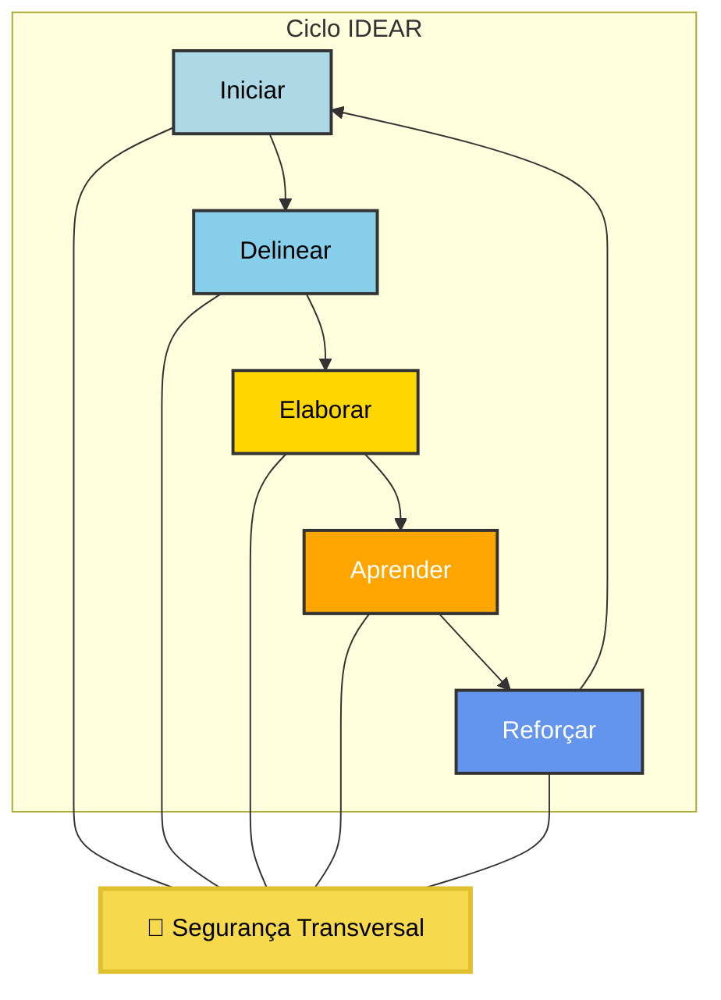

# IDEAR: O Ciclo Colaborativo para Excelência em Arquitetura de Software e Segurança

**IDEAR é o ciclo colaborativo que integra estratégia de negócio e as melhores práticas de arquitetura de software e segurança, capacitando equipes para construir soluções de alto valor, de forma contínua e rastreável.**

---

## 💡 Por Que o IDEAR?

No dinâmico mundo do desenvolvimento de software, equipes frequentemente enfrentam desafios que comprometem a qualidade, a segurança e o alinhamento com o negócio. O IDEAR nasceu para endereçar problemas como:

* Falta de visibilidade e rastreabilidade sobre decisões técnicas.
* Decisões arquiteturais e de segurança tardias e mal embasadas, gerando retrabalho.
* Falta de documentação viva, acessível e rastreável.
* Baixa autonomia técnica dos times de desenvolvimento.
* Alinhamento fraco entre técnica e estratégia de negócio.

O IDEAR formaliza o *porquê* antes do *como*, garantindo que construímos o *software certo*, *corretamente*, e **capacitando nossos times**.

---

## 🔄 Como o IDEAR Funciona: Nosso Ciclo Virtuoso

O IDEAR é uma filosofia de trabalho que organiza as melhores práticas da engenharia de software moderna em um fluxo de valor contínuo, com segurança intrínseca em cada etapa. Inspirado em **Domain-Driven Design (DDD)**, **Clean Architecture** e **Team Topologies**, e potencializado por **OKRs**, ele guia sua equipe pelas seguintes fases:

Diagrama IDEAR: O Ciclo com Segurança

* **I - Iniciar:** Onde o problema de negócio é compreendido e a Linguagem Ubíqua é forjada. É o ponto de partida do domínio.
* **D - Delinear:** Definição das fronteiras técnicas, Requisitos Não Funcionais (NFRs) e riscos, com segurança intrínseca ao caminho.
* **E - Elaborar:** Co-design colaborativo, registro de Decisões Arquiteturais (ADRs) e trade-offs conscientes.
* **A - Aprender:** Habilitação prática, mentoria, pairing e revisão de código para capacitar e aumentar a autonomia dos times.
* **R - Reforçar:** Transformação de lições aprendidas em padrões organizacionais e melhoria contínua, conectando o trabalho aos OKRs.

---

## ✨ Benefícios Chave do IDEAR

Adotar o IDEAR significa:

* **Clareza e Rastreabilidade:** Decisões técnicas e de segurança documentadas e acessíveis.
* **Segurança por Design:** Riscos mitigados desde a concepção.
* **Times Capacitados:** Aumento da autonomia e qualidade do código.
* **Alinhamento Estratégico:** Conexão clara entre tecnologia e objetivos de negócio.
* **Melhoria Contínua:** Um ciclo de feedback constante para evolução organizacional.
* **Adaptação e Flexibilidade:** Aplicação proporcional à complexidade do projeto, evitando burocracia.

---

## 🚀 Como Começar?

1.  **Explore a Documentação Completa:** Mergulhe nos detalhes do processo IDEAR, templates e justificativas.
2.  **Comece com um Projeto Piloto:** Aplique as fases do IDEAR em uma iniciativa de seu time.
3.  **Use os Templates Markdown:** Nossos templates leves e versionáveis facilitam o registro de decisões.

---

## 📚 Documentação Completa

Para um entendimento aprofundado do processo IDEAR, seus princípios, fases detalhadas, entregáveis e exemplos práticos, acesse nosso documento principal:

* [**IDEAR.md**](IDEAR.md) 

---

## 📄 Licença

Este projeto está licenciado sob a **MIT License**.

---

## ✍️ Autor e Idealizador

O framework IDEAR foi concebido e refinado por Márcio Augusto Alves Rosner.
---
